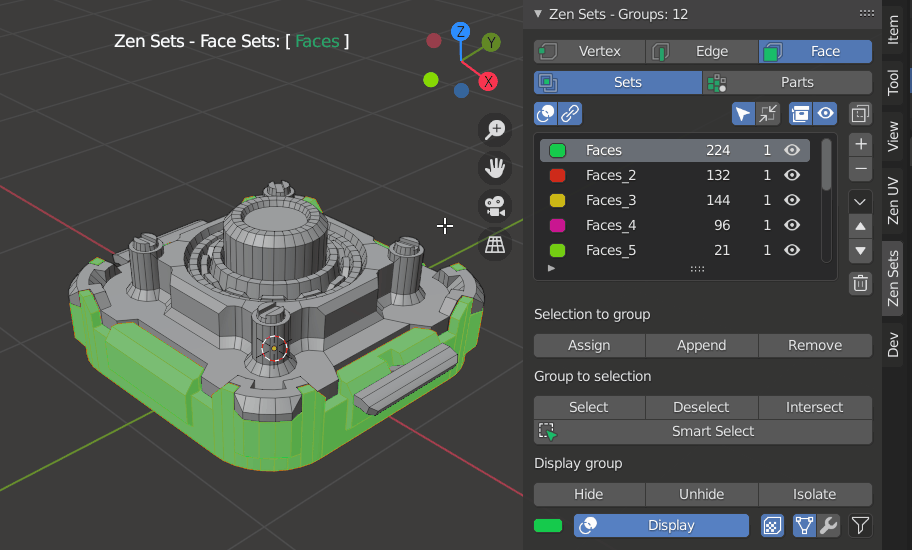
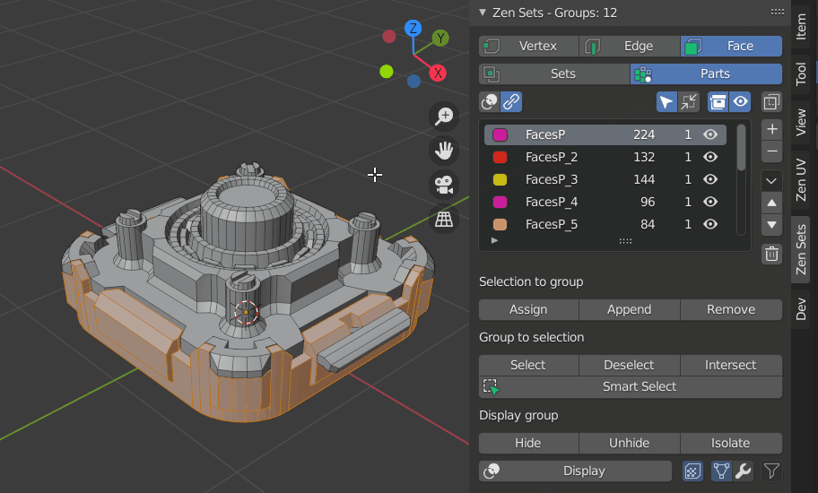

# Zen Sets for Blender 1.4.1

**Zen Sets** adds new functionality to:

- **Edit Mesh Mode** - it allows you to organize the mesh with visual grouping information. The mesh is only marked with metainformation and is still one contiguous surface. It is another way to control visibility state of the mesh in Blender Edit Mode

- **Object Mode** - it adds new functionality for the management of collections via a Pie Menu, Viewport Tool in the 3D Viewport. It also offers visual grouping information.

## Edit Mesh Mode

### Modes

#### Sets mode
One element (Vertex, Edge, Face) may be assigned to more than one group and only active group is displayed in the viewport

#### Parts mode
One element (Vertex, Edge, Face) may belong only to one group and all groups or active group can be displayed in the viewport

### Supported Elements

Geometry can be assigned to a vertex, edge or face group and each group is represented as a different color in the 3D Viewport

## Object Mode

### Object Smart Select and New Group Demo
The example demonstrates how to combine 2 collections by using New Group and Smart Select

**Enjoy this experience with us!**

 [**Gumroad**](https://sergeytyapkin.gumroad.com/l/zensets) |  [**BlenderMarket**](https://www.blendermarket.com/products/zen-sets) |  [**Discord**](https://discord.gg/wGpFeME)

<!-- blank line -->
----
<!-- blank line -->
## Main Features

- [**Intuitive UI**](mkdocs/npanel.md) with multifunctional **[N-Panel](mkdocs/npanel.md), Pie menu and [Workspace Tool](workspacetool.md)**.
- **Context-sensitive help** that is obtained from an every button in UI by pressing F1.
- [**Display System**](mkdocs/npanel.md#display-group) that helps find and select each Group by displaying it by color in the viewport.
- **[Zen Sets Workspace Tool](mkdocs/workspacetool.md)** for fast switching between Elements Modes. It also provides a simulation of Zbrush Polygroup behavior for [Selecting and Hiding Groups](mkdocs/workspacetool.md).
- [**Import / Export Zen Sets Groups**](mkdocs/imp_exp.md) to native Vertex Groups, Face Maps, Vertex Colors, and vice versa.
- [**Auto Groups Operator**](mkdocs/tools.md#auto-groups) to create Groups automatically from linked faces.
- [**Create Objects from Groups Operator**](mkdocs/tools.md#create-objects-from-groups). Divide mesh into Objects using Zen Sets Groups.
- [**Assign Materials to Groups Operator**](mkdocs/tools.md#assign-materials-to-groups).
- [**Possibility to use Zen Sets Groups by external operators**](mkdocs/api.md). Implement Zen Sets for your own pipelines.

## Default Shortcuts
You may override or disable every Zen Sets hotkey in addon preferences Keymap section

