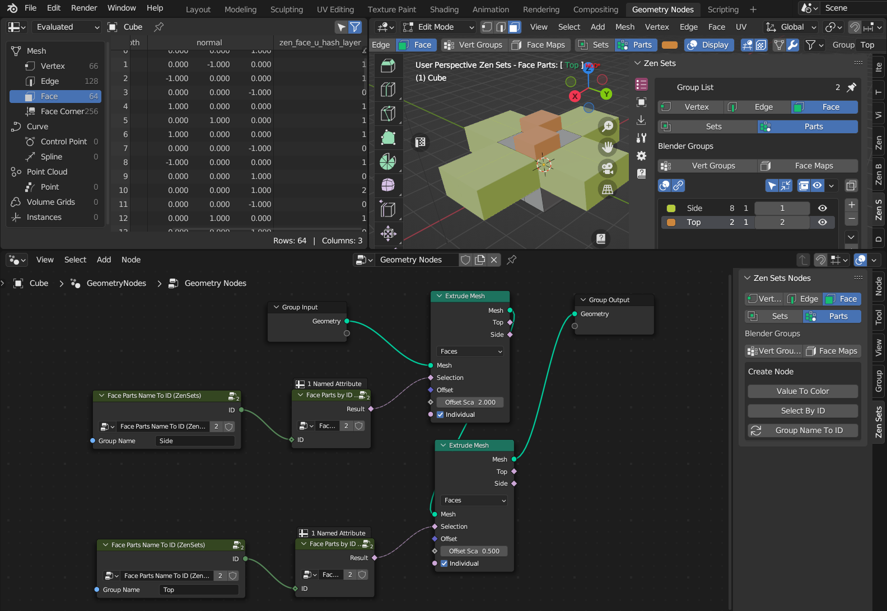
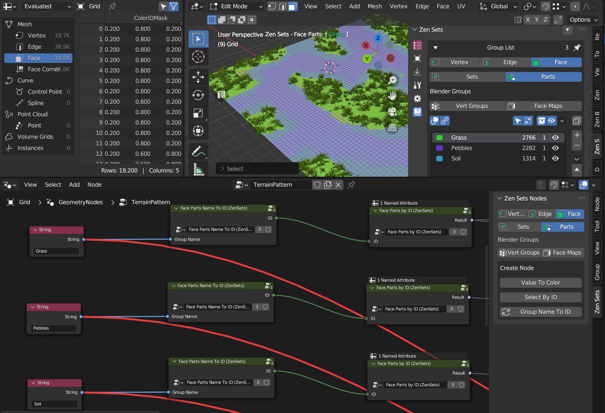
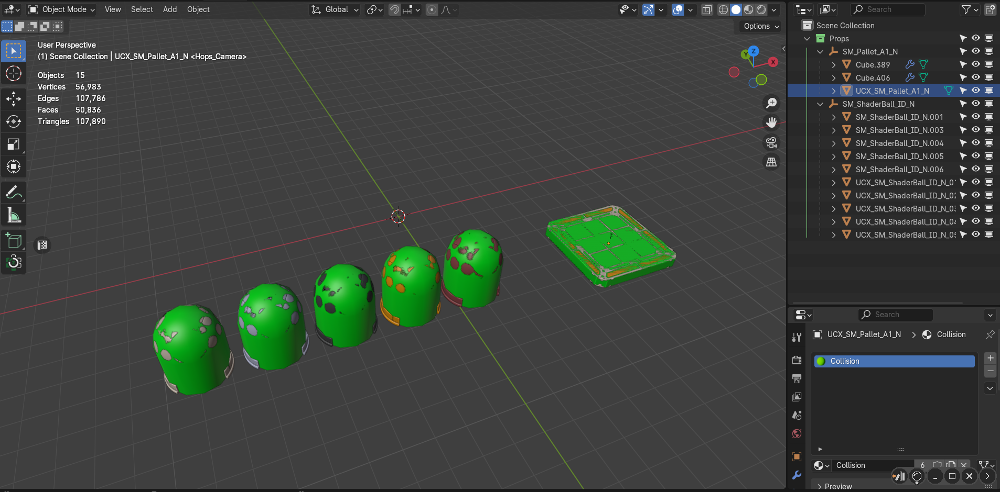

# Examples

## Mesh

### Modes Preview
Demonstration of all Zen Sets Modes:
Vert, Edge, Face Sets and Parts

[//]: # (https://github.com/zen-masters/Zen-Sets/raw/main/examples/ZenSets_MeshButton.zip)

## Geometry Nodes

### Extrude Mesh
Demonstration how to use Zen Sets groups
for extrude mesh geometry node modificator

#### Details
|  |
|---|
| |

[//]: # (https://github.com/zen-masters/Zen-Sets/raw/main/examples/ZenSets_GroupsForExtrude.zip)

### Terrain Layers
Demonstration how to set procedural
Terrain Layers materials and
mesh scattering based on Zen Sets Groups

#### Details
|  |
|---|
| |

[//]: # (https://github.com/zen-masters/Zen-Sets/raw/main/examples/ZenSets_TerrainLayers.zip)

## Custom Scripts

### Nova Export
Demonstration how to export objects to Unreal Engine fbx

#### Details
|  |
|---|
| |

[//]: # (https://github.com/zen-masters/Zen-Sets/raw/main/examples/NOVA_Export_Test.zip)

