# Geometry Nodes
Every Zen Sets group can be used in Geometry Nodes. Attribute implementation depends on Sets or Parts mode

| 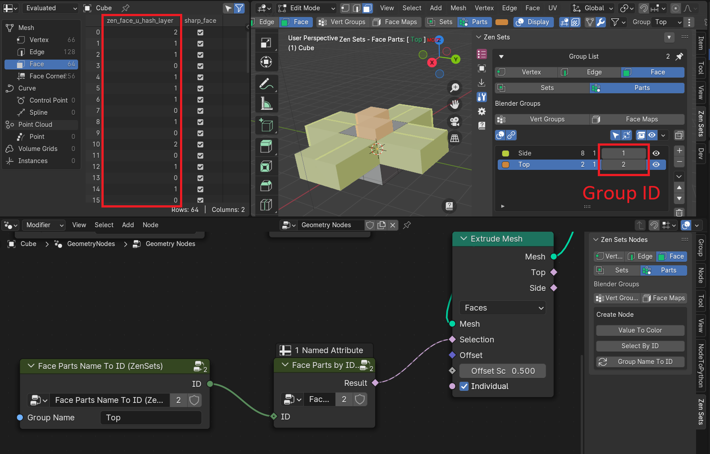 |
|---|
| |

!!! WARNING
    Do not delete or rename Group Attributes manually !
    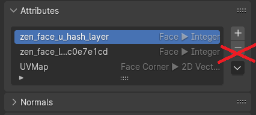

## Parts Mode
There is a fixed attribute for every Parts mode. Every group has its own unique integer identifier within the current Scene. 

!!! NOTE
    Value 0 is used for elements that are not assigned to any group

| Mode | Mesh Element | Attribute Name |
|---|---|---|
| Vert Parts | Vertex | zen_vert_u_hash_layer |
| Edge Parts | Edge | zen_edge_u_hash_layer |
| Face Parts | Face | zen_face_u_hash_layer |
| Face Maps | Face | face_maps |

## Sets Mode
Every group in Sets Mode is exposed as separate integer attribute with 1 value if elemement belongs to the group and 0 if not.

| 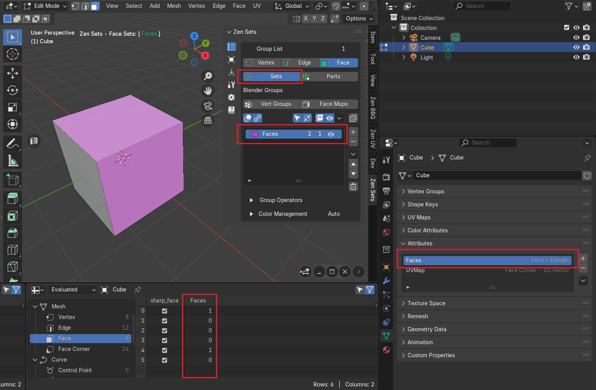 |
|---|
| Option to switch attribute naming |

| 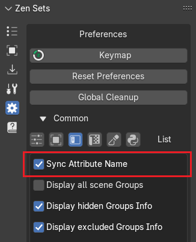 |
|---|
| Face Sets group and its attribute |

### Attribute Names Match Group Name
If option 'Sync Attribute Name' is set attribute will have the same name as the group name

!!! WARNING
    You should take care about group naming to prevent name collisions with Blender internal attributes

    | 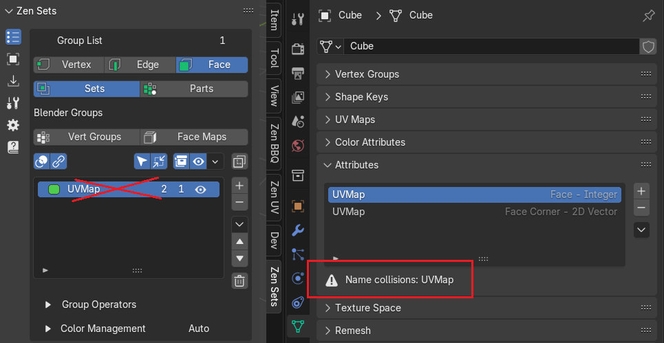 |
    |---|
    | Example of attribute name collisions |

### Attribute Names Are Unique
If option 'Sync Attribute Name' is unset then attribute will have unique name with the next format:
```
zen_{vert|edge|face}_{128-bit uuid}
```

| 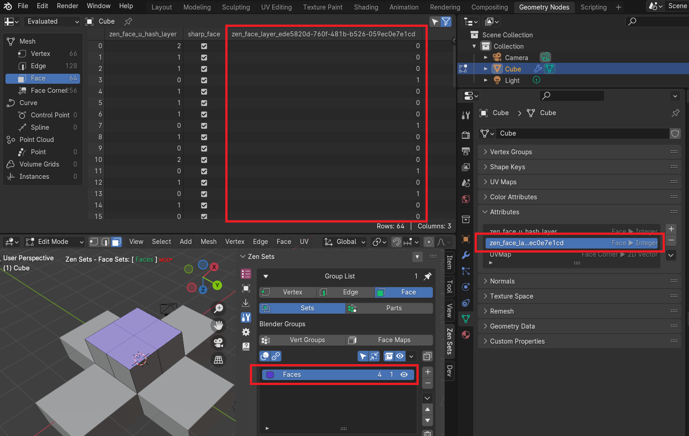 |
|---|
| Example of the default Face Set attribute |

### How To Change Face Sets Attribute Name
| 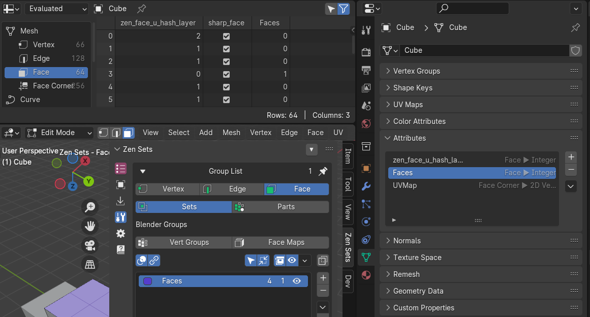 |
|---|
| Example of Face Sets group renamed to the simple name |

1. Call **Change Group Attribute Name** operator
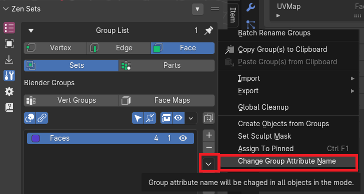

2. Type New Attribute Name and press **OK**
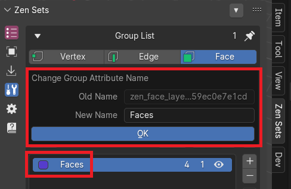

## Create Node

!!! NOTE
    Available in Parts Mode only

### Value To Color Node
| 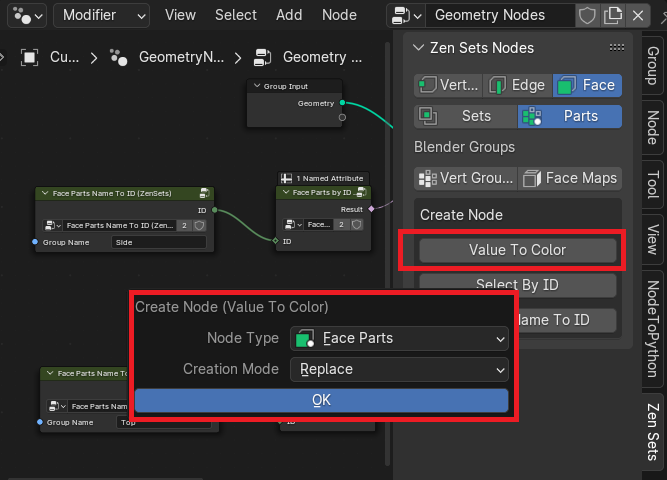 |
|---|
| Add node to the editor and connect to outputs |
| 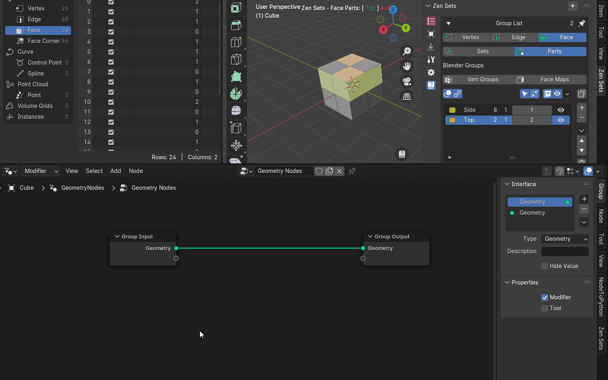 |
| Encode group identifiers with color values and create temporary color attribute |
|  |

### Selection By ID Node
| 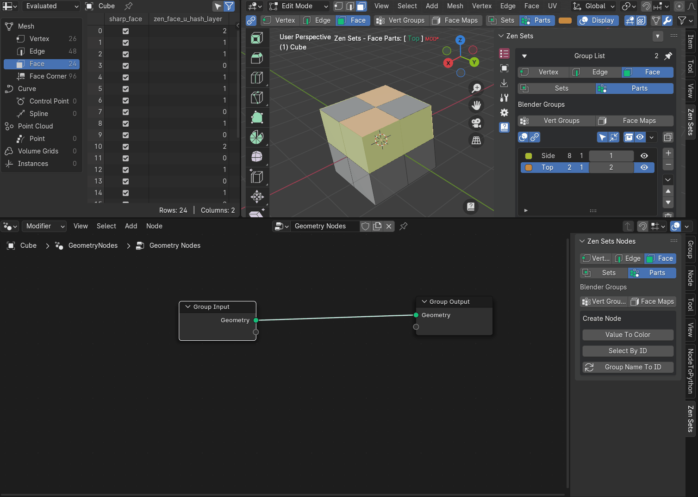 |
|---|
| Example how to add and use Select By ID node for Extrude Mesh modificator |

### Group Name To ID
| 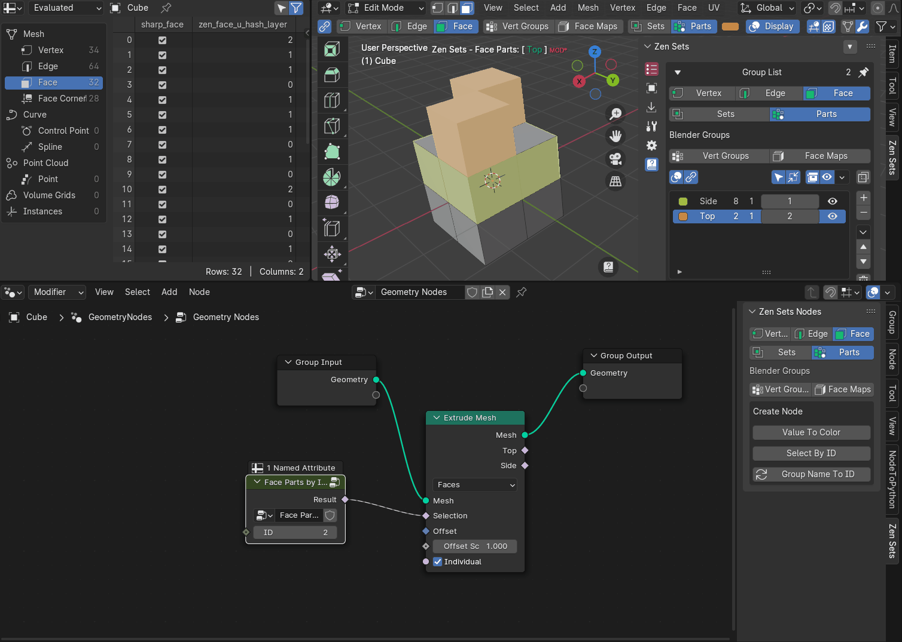 |
|---|
| Example how to use group names in Geometry Nodes |
