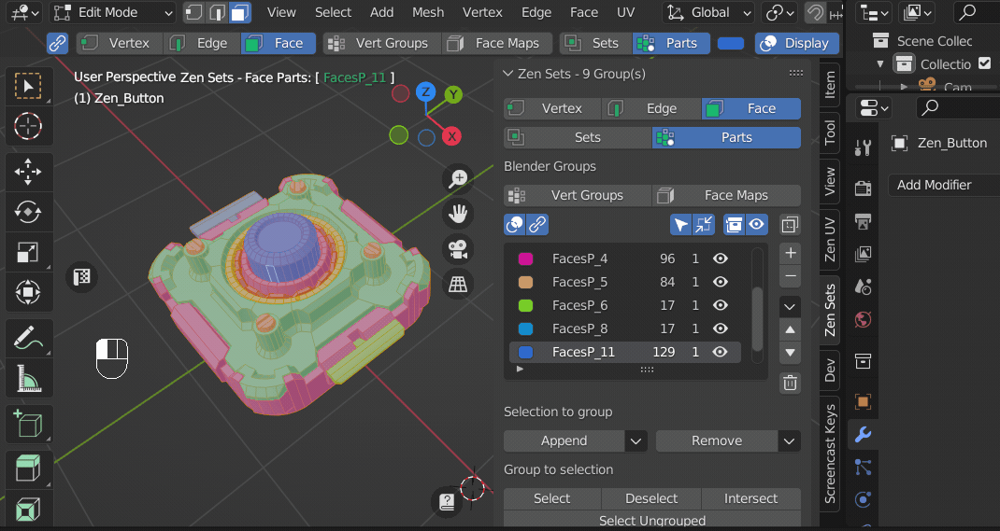
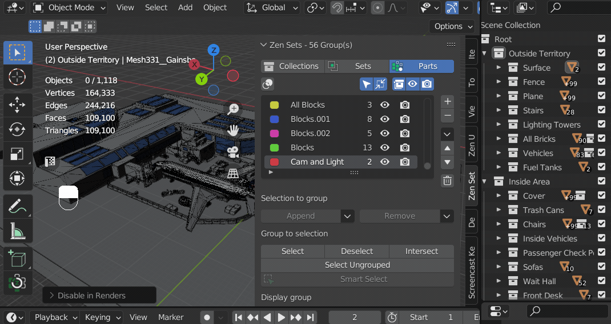

# Group Combined Operators
All operators of this type have the same behaviour:

| Key | Operation|
|---|---|
| **Default** | Toggle property |
| **Ctrl** | Isolate-Restore property |
| **Shift** | Restore All |

## Hide in Viewport
- **Default:** Hide-Unhide in Viewport
- **Ctrl**: Isolate-Restore Group
- **Shift**: Unhide All Groups

## Disable in Renders
- **Default:** Disable-Enable in Renders
- **Ctrl**: Isolate-Restore in Renders
- **Shift**: Enable All in Renders

