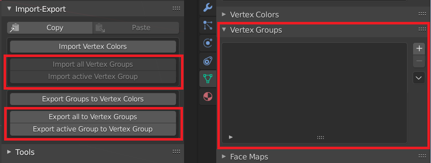
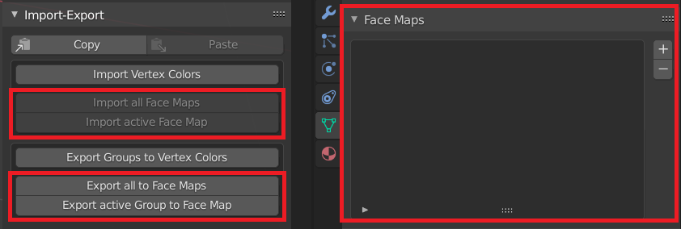

# Import-Export

## Copy to Clipboard
Copies Groups data to Clipboard in JSON format

## Paste from Clipboard
Pastes Groups data from Clipboard and applies to the objects in the Edit Mode

!!! Notice
    **Copy-Paste operation is available only for the same objects**

## Import-export Blender Vertex Colors
Available in all Zen Sets modes

- **Active**  
Imports-exports only active Group

- **All**  
Imports-exports all Groups

- **Generate New Vertex Color Layer**  
Creates new Vertex Color layer for every Zen Sets Group

!!! Notice
    **[Blender Vertex Color Layers count are limited to 8 !](https://blender.stackexchange.com/questions/166257/are-vertex-color-layers-limited-to-8)**

## Import-export Blender Vertex Groups
Available in Zen Sets Vert Sets, Vert Parts modes

## Import-export Blender Face Maps
Available in Zen Sets Face Sets, Face Parts modes

