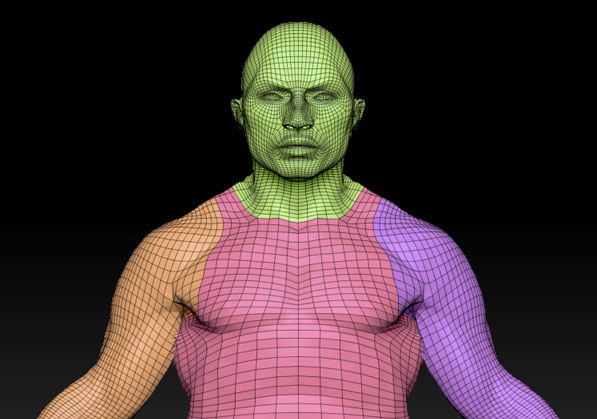

# Zen Sets for Blender 1.0

**Zen Sets** allow you to organize the mesh with visual grouping information. The mesh is only marked with metainformation and is still one contiguous surface.

## Modes of Zen Sets
### Sets mode
One element (Vertex, Edge, Face) may be assigned to different groups

### Parts mode
One element (Vertex, Edge, Face) may belong only to one group

**Enjoy this experience with us!**

 [**Gumroad**](https://gumroad.com/l/ZenUV) |  [**BlenderMarket**](https://www.blendermarket.com/products/zen-uv) |  [**Discord**](https://discord.gg/wGpFeME)

<!-- blank line -->
----
<!-- blank line -->
## Main (Cool) Features

- Intuitive UI with multifunctional Main, Pie and Popup menus. **You will like it!**
- Quick support on the [**Discord channel**](https://discord.gg/wGpFeME).

## Default Shortcut
- Zen Sets Pie Menu --- `Alt + F9`
