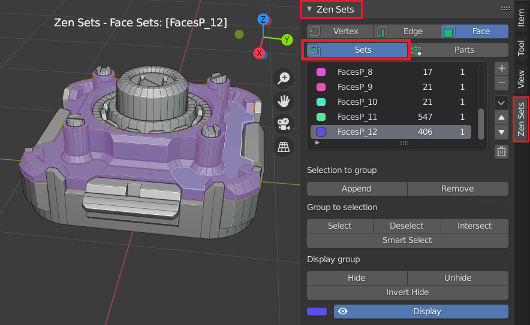
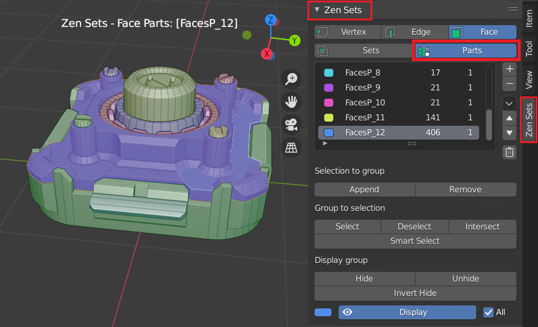

# Zen Sets for Blender 1.0

**Zen Sets** allow you to organize the mesh with visual grouping information. The mesh is only marked with metainformation and is still one contiguous surface. It is another way to control visibility state of the mesh in Blender Edit Mode

## Modes

### Sets mode
One element (Vertex, Edge, Face) may be assigned to more than one group and only active group is displayed in the viewport

### Parts mode
One element (Vertex, Edge, Face) may belong only to one group and all groups or active group can be displayed in the viewport

## Supported Elements

Geometry can be assigned to a vertex, edge or face group and each group is represented as a different color in the 3D Viewport

**Enjoy this experience with us!**

 [**Gumroad**](https://sergeytyapkin.gumroad.com/l/zensets) |  [**BlenderMarket**](https://www.blendermarket.com/products/zen-sets) |  [**Discord**](https://discord.gg/wGpFeME)

<!-- blank line -->
----
<!-- blank line -->
## Main (Cool) Features

- Intuitive UI with multifunctional Pie menu and WorkSpaceTool. **You will like it!**
- Quick support on the [**Discord channel**](https://discord.gg/wGpFeME).

## Default Shortcuts
- Zen Sets Pie Menu --- `Ctrl + Shift + D`
