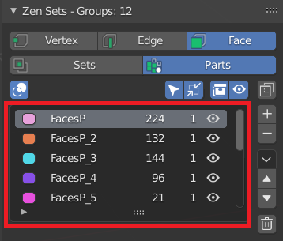

# Zen Sets N-Panel
N-Panel contains all Zen Sets addon functionality and consits of [Main](#main-subpanel), [Import-Export](imp_exp.md), [Tools](tools.md), [Preferences](preferences.md) and [Help](help.md) collapsible subpanels.

!!! Notice
    **This panel is available only in Blender Edit Mode and Object Mode**

    

---

## Main Subpanel
Contains all basic functionality for managing Zen Sets

### Active Zen Sets Element Switch
Gives an option to change type of mesh geometry (vertex, edge or face) that can be assigned to a group

!!! Notice
    **Zen Sets active element is synchronized with the Blender mesh selection mode by default**
    

!!! Notice
    **You can disable synchronization with mesh selection in addon preferences**
    

### Active Zen Sets Mode Switch

#### Sets mode
One element (Vertex, Edge, Face) may be assigned to more than one group and only active group is displayed in the viewport

#### Parts mode
One element (Vertex, Edge, Face) may belong only to one group and all groups or active group can be displayed in the viewport

---

### Groups List

Contains the following information:

- **Group Color**
- **Group Name**
- **Mesh Elements Count**
Shows how many mesh elements (verts, edges or faces) are in the current group
- **Objects Count**
Shows how many objects in edit mode has elements with the same group
- **Visibility Group Icon (eye icon)**
    - Group is completely visible
        - 
    - Group is partially visible
        - 
    - Group is completely hidden
        - 

---

### Toolbar

The Toolbar shows [Groups List](#groups-list) main settings and [Display toggle button](#display)

-  **Display Groups in Viewport**

-  **Selection follows Selected Group** (Select all elements after Selected Group has been changed)

-  **Auto Frame Selected Elements** (Move the view to the Selected elements center when selection changes)

-  **Display count of objects that have the Group**

-  **Display hidden Groups Info**

-  **Display all scene Groups or selected object groups**

---

### Sidebar

#### Add New Group
Creates new Group from selected mesh elements
#### Delete Active Group
Deletes Active Group from the selected Objects
#### Show Popup menu
Shows main panel Popup menu
#### Move Active Group Up
Moves active Group up in the Group List
#### Move Active Group Down
Moves active Group down in the Group List
#### Delete Groups
- **Empty Groups**
Deletes Groups that does not contain any mesh elements
- **Delete All Groups**
    * Deletes all groups in the Scene if **Display all scene Groups** option **is set**
    * Deletes all groups in the Selected Objects if **Display all scene Groups** option **is unset**

---

### Main panel Popup Menu

#### Select all objects by Group ID
Selects and adds to the Edit Mode all Objects that has the Active Group elements

#### Batch rename Groups
Option to rename all Groups in the list

---

### Selection to group
#### Append
Appends selected Elements to selected Group

#### Remove
Removes selected Elements from selected Group

---

### Group to selection
#### Select
Selects Elements of selected Group
- **Clear selection** - an option to clear previous selection

#### Deselect
Removes selected Group Elements from mesh selection

#### Intersect
Selects Group Elements intersected with mesh selection

#### Smart select
Depends on selected mesh elements and has the next behaviour:

- **Select Group by selected Elements in Viewport**
If mesh selection belongs to Zen Sets group, all group elements are selected and other elements are deselected

- **Deselect Active Group and select Elements that does not belong to any group**
If mesh selection does not belong to any Zen Sets group, the active group is deselected and all mesh elements that don't have group metainformation are selected

---

### Display group
You can highlight the active group in [Sets mode](npanel.md#sets-mode) or all groups in [Parts mode](npanel.md#parts-mode). Also you can hide, unhide active group or hide elements that don't belong to the active group

#### Hide
Hides active group
#### Unhide 
Unhides active group
#### Isolate
Hides elements that don't belong to active group or restore (unhide) all elements if the group was previously isolated
#### Display
Toggles the display of the active group in [Sets Mode](npanel.md#sets-mode) or all groups in [Parts Mode](npanel.md#parts-mode)

### Palette Panel
Gives an option to adjust user colors when a new color is generated for new group

#### Auto Mode
Colors are created in random order of Zen Sets default palette

#### User Palette Mode
Colors are selected from user palette

- **Sequence Mode**
- **Random Mode**

---

## [Import-Export Subpanel](imp_exp.md)

## [Tools Subpanel](tools.md)

## [Help Subpanel](help.md)
