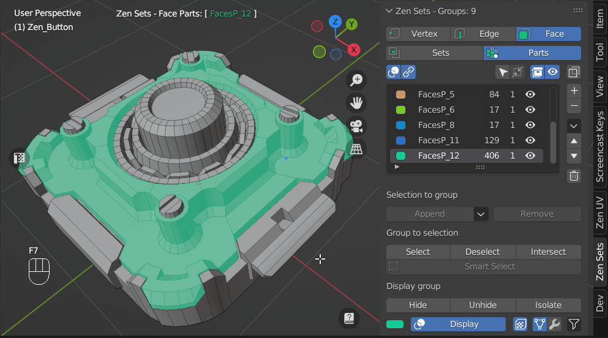

# Zen Sets N-Panel
N-Panel contains all Zen Sets addon functionality and consits of Main, Tools, Preferences and Help collapsible subpanels.
> **NOTICE! This panel is available only in edit mode, when the object being edited as a mesh**

---

## Main Subpanel
Contains all basic functionality for managing Zen Sets

### Active Zen Sets Element Switch
Gives an option to change type of mesh geometry (vertex, edge or face) that can be assigned to a group

> **NOTICE! Zen Sets active element is synchronized with the Blender mesh selection mode**

### Active Zen Sets Mode Switch

#### Sets mode
One element (Vertex, Edge, Face) may be assigned to more than one group and only active group is displayed in the viewport

#### Parts mode
One element (Vertex, Edge, Face) may belong only to one group and all groups or active group can be displayed in the viewport

### Groups List

Contains the following information:

- **Group Color**
- **Group Name**
- **Mesh Elements Count**
- **Objects Count**

### Selection to group
#### Append
Appends selected Elements to selected Group

#### Remove
Removes selected Elements from selected Group

### Group to selection
#### Select
Selects Elements of selected Group
- **Clear selection** - an option to clear previous selection

#### Deselect
Removes selected Group Elements from mesh selection

#### Intersect
Selects Group Elements intersected with mesh selection

#### Smart select
Depends on selected mesh elements and has the next behaviour:
- **Select Group by selected Elements in Viewport**
If mesh selection belongs to Zen Sets group, all group elements are selected and other elements are deselected
- **Deselect Active Group and select Elements that does not belong to any group**
If mesh selection does not belong to any Zen Sets group, the active group is deselected and all mesh elements that don't have group metainformation are selected

### Display group
You can highlight the active group in [Sets mode](npanel.md#sets-mode) or all groups in [Parts mode](npanel.md#parts-mode). Also you can hide, unhide active group or hide elements that don't belong to the active group

#### Hide
Hides active group
#### Unhide 
Unhides active group
#### Invert hide
Hides elements that don't belong to active group
#### Display
Toggles the display of the active group in [Sets Mode](npanel.md#sets-mode) or all groups in [Parts Mode](npanel.md#parts-mode)

## Tools Subpanel

## [Help](help.md) Subpanel
