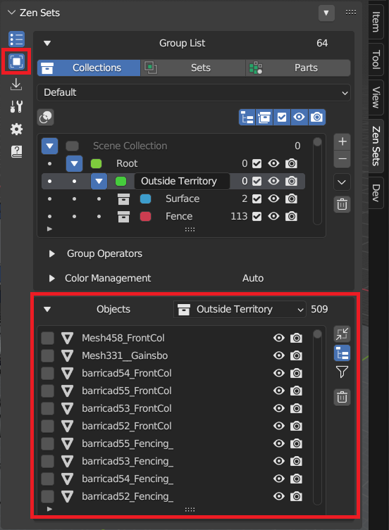
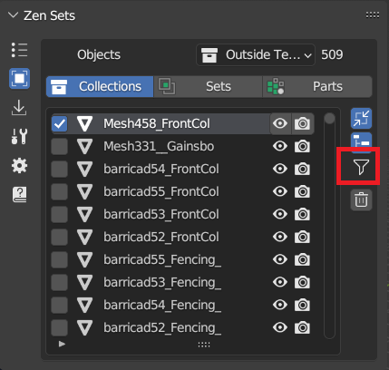
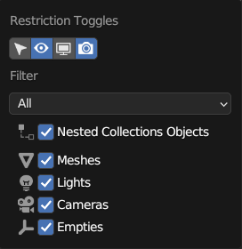
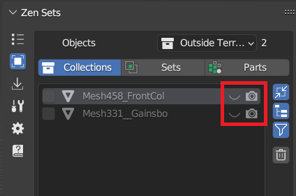

# Objects Panel
Quick access to the list of group objects in Object Mode and edited objects in Edit Mode

|  |
|---|

## View Selected Objects
Changes the view so that you can see the selected object in the center of the viewport

|  |
|---|

## Filter
The list of objects can be filtered by different conditions

|  |  |
|---|---|

* **All** - The default option, no restrictions
* **Visible** - List only the objects visible in the viewports. The global and temporary visibility settings are taken into consideration
* **Selectable** - List all objects whose Selectability option is enabled
* **Different values** - List object that have different values of restriction toggles

* **Unique Data** - List the objects with only unique data. Linked objects are dropped
* **Vertex Groups** - List only the objects with vertex groups
* **Modifiers** - List only the objects with modifiers