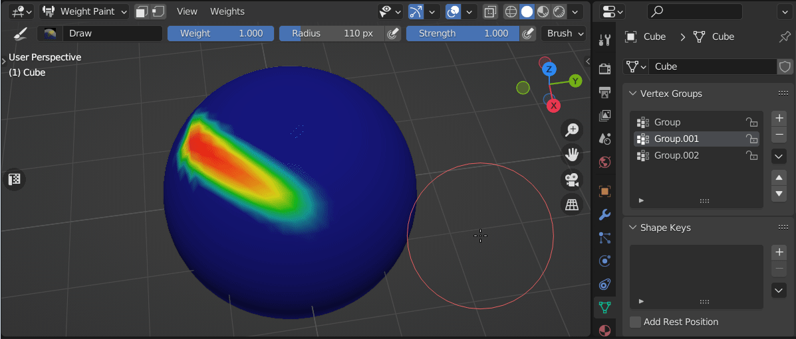

# Sculpt Utils

## Sculpt Vertex Groups Masks Panel
Enhances sculpt mask operations in sculpt mode. Gives an option loading or saving masks to vertex groups.

|  |
|---|

### Add
Adds current vertex group weights multiplied by strength to sculpt mask

|  |
|---|
| **Accumulate Mask Weight** |
| Disable limiting mask weight to maximum of current value and vertex group weight |

### Replace
Replace sculpt mask with current vertex group weights multiplied by strength

### Subtract
Subtract current vertex group weights multiplied by strength from sculpt mask

### Intersect
Intersect sculpt mask with current vertex group by multiplying mask and vertex group weights

### Save Sculpt Mask to Group
Overwrite current Vertex Group with sculpt mask

## Sculpt Toolbar Panel
|  |
|---|

### Set Sculpt Mask by Editmode Selection
|  |
|---|

### Set Sculpt Mask by current Vertex Group
|  |
|---|