# Tools
Zen Sets provides a variety of tools for editing meshes and organizing objects in Blender. Tools can be accessed either or from N-Panel popup menu

|  | 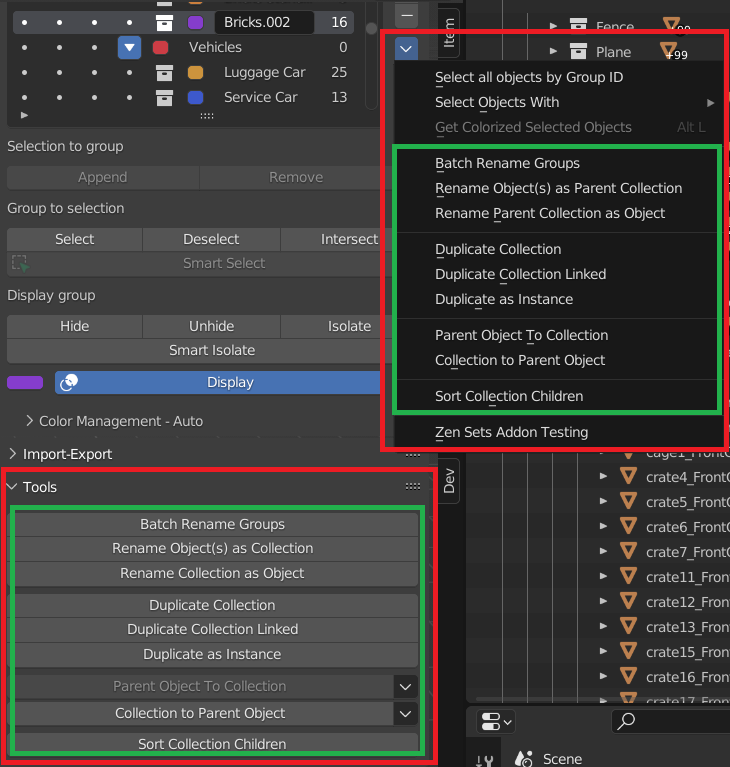 |
|---|---|
| Tools Subpanel | N-Panel Popup menu |

## Edit Mesh Tools

### Auto Groups
|  |
|---|

### Auto Groups by custom operator
|  |
|---|

### Create Objects from Groups
|  |
|---|

### Assign materials to Groups
|  |
|---|

### Split Group edges
|  |
|---|

### Mark and clear seams
The menu options marks or clear seams in the Selected Group

|  |
|---|

### Assign to Pinned Group
!!! Notice
    **This option is available only in Sets Mode**

### Assign UV Borders To Group
!!! Notice
    **This option is available only in Edge Sets Mode**

|  |
|---|
| Assign UV Borders demo |

### Remove Weight
Remove elements with Vertex Weight in given range from Active or All Group(s)

!!! tip
    This operator can be used to remove Elements with Zero Weight from Group

| 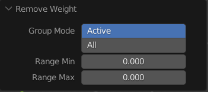 |
|---|
| Remove Weight settings |

| 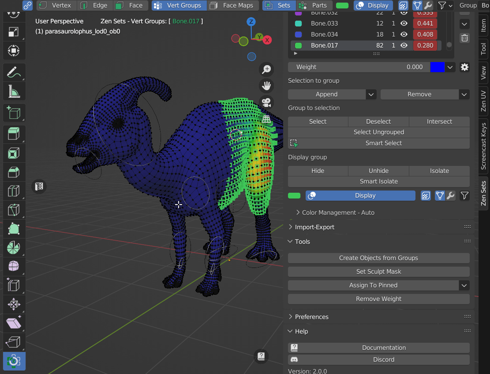 |
|---|
| Remove Weight settings demo |

### Change Weight in Selected Group
| 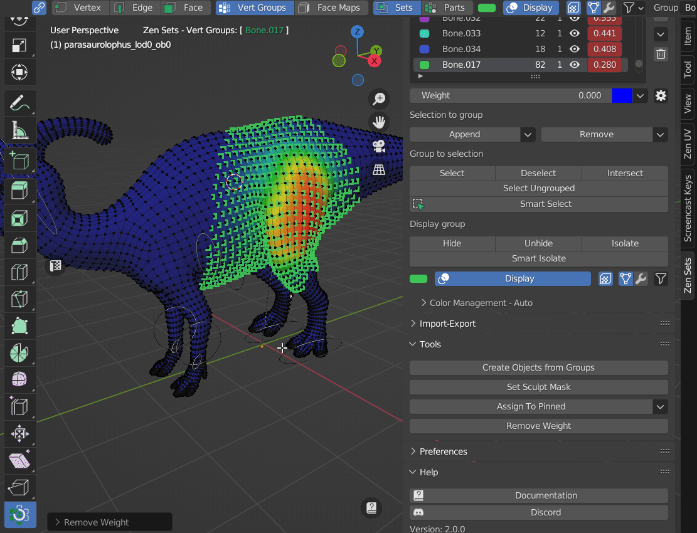 |
|---|

## Object Tools

### Batch Rename Groups

### Duplicate Collection
This will create a visually-identical copy of the Active Collection object(s).

This copy are new objects, which share data-blocks with the original objects (by default, all the materials, textures, and F-curves), but which has copied others, like the mesh, for example. That is why this form of duplication is sometimes called **shallow link**, because not all data-blocks are shared; some of them are **hard copied**!

### Duplicate Collection Linked
You also have the choice of creating a Linked Duplicate rather than a Duplicate; this is called a **deep link**.

This will create a new object with all of its data linked to the original object. If you modify one of the linked objects in Edit Mode, all linked copies are modified. Transform properties (object data-blocks) still remain copies, not links, so you still can rotate, scale, and move freely without affecting the other copies.

### Duplicate as Instance
This creates an instance of the collection with the transformation of the object. Collection instancers can be animated using actions, or can get a Proxy.

### Convert Parent Object to Collection

| 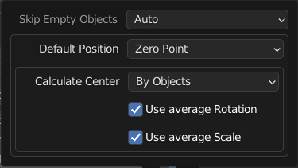 |
|---|
| Convert Parent Object to Collection settings |

- **Skip Empty Objects**
    * **Auto** - Skip Empty Parent Objects by calculated Collection Center
    * **Skip All** - Skip all Empty Parent Objects
    * **Load All** - Load all Empty Parent Objects
- **Default Position**
    * **Zero Point** - Move Parent object to zero coordinate position
    * **Cursor 3D** - Move Parent object to Cursor 3D position
- **Calculate Center**
    * **By Default Position** - Collection Center will be defined by Default Position Zero Point or Cursor 3D
    * **By Objects** - Collection Center will be calculated as average children origins point
    * **By Nested Objects** - Collection Center will be calculated as average itself children and all nested collections children origins point
- **Use Average Rotation** - Calculate Center position with average rotation
- **Use Average Scale** - Calculate Center position with average scale

| 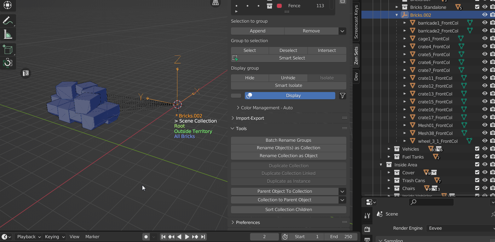 |
|---|
| Convert Parent Object to Collection demo |

### Convert Collection to Parent Object

| 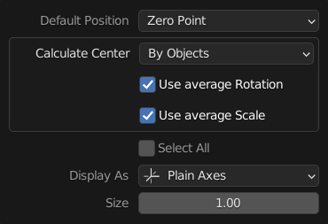 |
|---|

- **Default Position**
    * **Zero Point** - Move Parent object to zero coordinate position
    * **Cursor 3D** - Move Parent object to Cursor 3D position
- **Calculate Center**
    * **By Default Position** - Collection Center will be defined by Default Position Zero Point or Cursor 3D
    * **By Objects** - Collection Center will be calculated as average children origins point
    * **By Nested Objects** - Collection Center will be calculated as average itself children and all nested collections children origins point
- **Use Average Rotation** - Calculate Center position with average rotation
- **Use Average Scale** - Calculate Center position with average scale
- **Select All** - Select all child Objects
- **Display As** - Representation of Parent Object as value of enum ['Plain Axes', 'Arrows', 'Single Arrow', 'Circle', 'Cube', 'Sphere', 'Cone', 'Image']

| 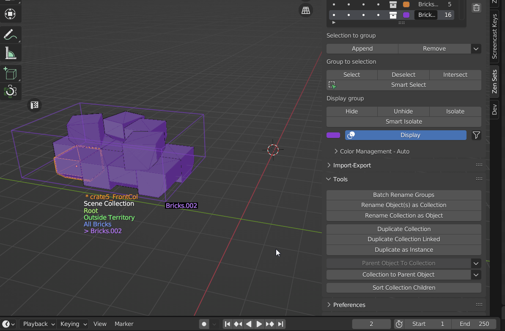 |
|---|
| Convert Collection to Parent Object demo |

### Example How To Rotate Collection Around a Point

|  |
|---|

### Sort Collections
Blender Outliner has only creation order in the list of collections. There is an option "sort alphabetically" but it only works for objects. For those who has numerious collections we offer "Sort Collection Children" option

|  |
|---|
| Sort Collections settings |

#### Modes
- **Human Sort** - the ordering of strings in alphabetical order, except that multi-digit numbers are treated atomically, i.e., as if they were a single character
- **Human Last Integer** - sort by last integer, than in alphabetical order
- **Human First Integer** - sort by first integer, than in alphabetical order
- **Alpha Sort** - Pure alphabetical sort order
- **Shuffle** - Shuffle a list (reorganize the order of the Collection items)

| 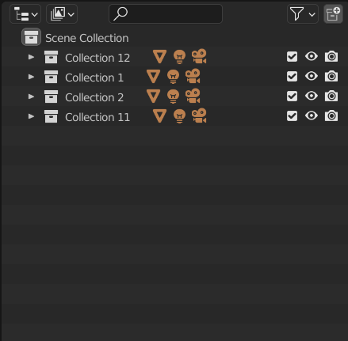 | 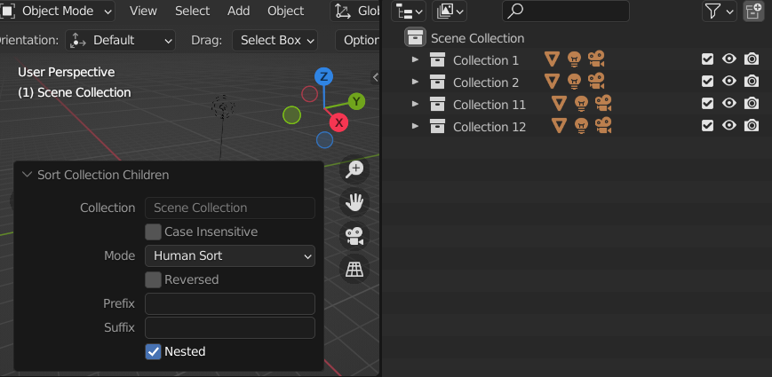 |
|---|---|
|  |  |

#### Order of sort
##### 1. Suffix (Delimiter string)
If suffix value is set, then Collections with suffix go up

| Full name | Suffix | Suffix substring |
|---|---|---|
| Collection.001 | . | 001 |
| Collection.002 | . | 002 |

| 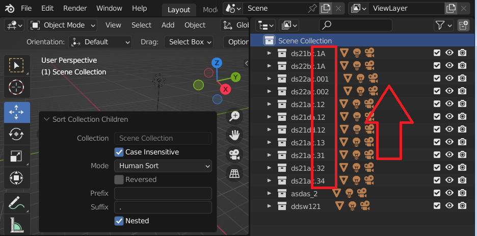 |
|---|
| Example: **sort by suffix '.'** |

##### 2. Prefix (Delimiter string)
If prefix value is set, then Collections with prefix go up

| Full name | Prefix | Prefix substring |
|---|---|---|
| HerCollection.001 | Collection | Her |
| HisCollection.001 | Collection | His |

| 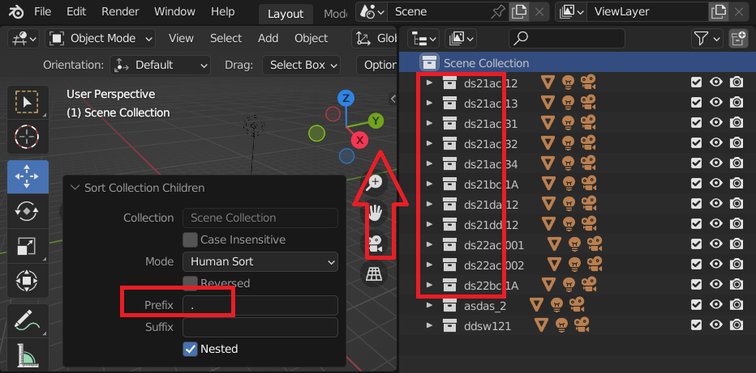 |
|---|
| Example: **sort by prefix '.'** |

##### 3. Body Substring from suffix to prefix
If prefix is set, then substring starts from prefix otherwise from the beginning

If suffix is set, then substring ends till suffix otherwise the end

| Full name | Prefix | Suffix | Body Substring |
|---|---|---|---|
| start-Collection001.end  | - | . | Collection001 |
| start-Collection002.end  | - | . | Collection002 |
| start-Collection003.end  | - | . | Collection003 |

|  |
|---|
| Sort Children Collections demo |

### Remove Linked
|  |
|---|
| Remove Objects with linked data from Group |

### Set Sculpt Mask
|  |
|---|
| Set Sculpt Mask settings |

|  |
|---|
| Set Sculpt Mask Demo |
