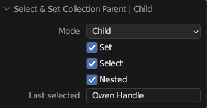

# Zen Sets View3D Workspace Tool
Zen Sets Tool is used to work with Zen Sets Groups directly on the surface of your model.

### Show Only One Group
Press **`CTRL+SHIFT`** and **`click`** on the mesh where that group is.

### Show All Groups
Press **`CTRL+SHIFT`** and **`click`** outside of the mesh.

### Invert Your Current Group Selection
Press **`CTRL+SHIFT`** then **`click and drag`** outside of the mesh.

### Select More Than One Group
1. Press **`CTRL+SHIFT`** and **`click`** on the mesh where one group is
2. Invert that selection: press **`CTRL+SHIFT`** then **`click and drag`** outside of the mesh
3. Press **`CTRL+SHIFT`** and **`click`** on the other groups you want to select
4. Invert this selection: press **`CTRL+SHIFT`** then **`click and drag`** outside the model

## Object Mode
### Collection Toolbar
- Quick collection toolbar with the options to append-remove object, toggle hide, select, exclude, disable

- Mouse operations to isolate, unhide, invert object selection

### Collection Selector
#### Next Collection - **`Ctrl + Mouse Wheel`**
Changes active Collection to the next in the list of all Collections and starts from the first when reaches the end.

#### Next Selected Object Collection - **`Ctrl + Shift + Mouse Wheel`**
Changes active Collection to the next in the list of all Selected Object Collections and starts from the first when reaches the end.

### Select and Set Collection Parent or Child
If you need to set active collection parent or child in 3D View without going to Tool mode there are corresponding operators

|  |
|---|
|  |
|  |
|  |