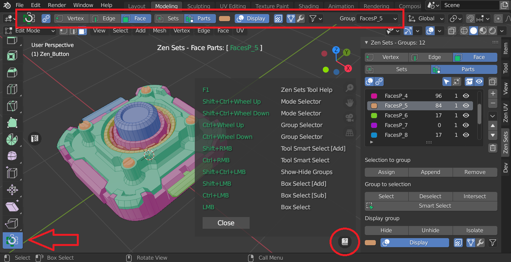
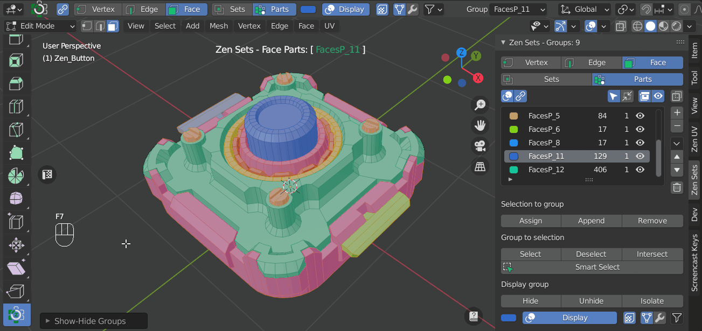
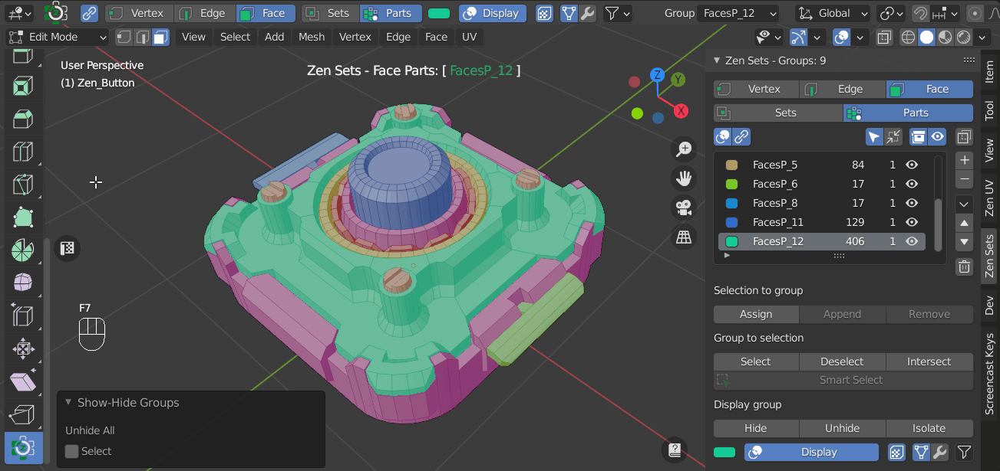

# Zen Sets View3D Workspace Tool
Zen Sets Tool is used to work with Zen Sets Groups directly on the surface of your model.

### Show Only One Group
Press **`CTRL+SHIFT`** and **`click`** on the mesh where that group is.

### Show All Groups
Press **`CTRL+SHIFT`** and **`click`** outside of the mesh.

### Invert Your Current Group Selection
Press **`CTRL+SHIFT`** then **`click and drag`** outside of the mesh.

### Select More Than One Group
1. Press **`CTRL+SHIFT`** and **`click`** on the mesh where one group is
2. Invert that selection: press **`CTRL+SHIFT`** then **`click and drag`** outside of the mesh
3. Press **`CTRL+SHIFT`** and **`click`** on the other groups you want to select
4. Invert this selection: press **`CTRL+SHIFT`** then **`click and drag`** outside the model

